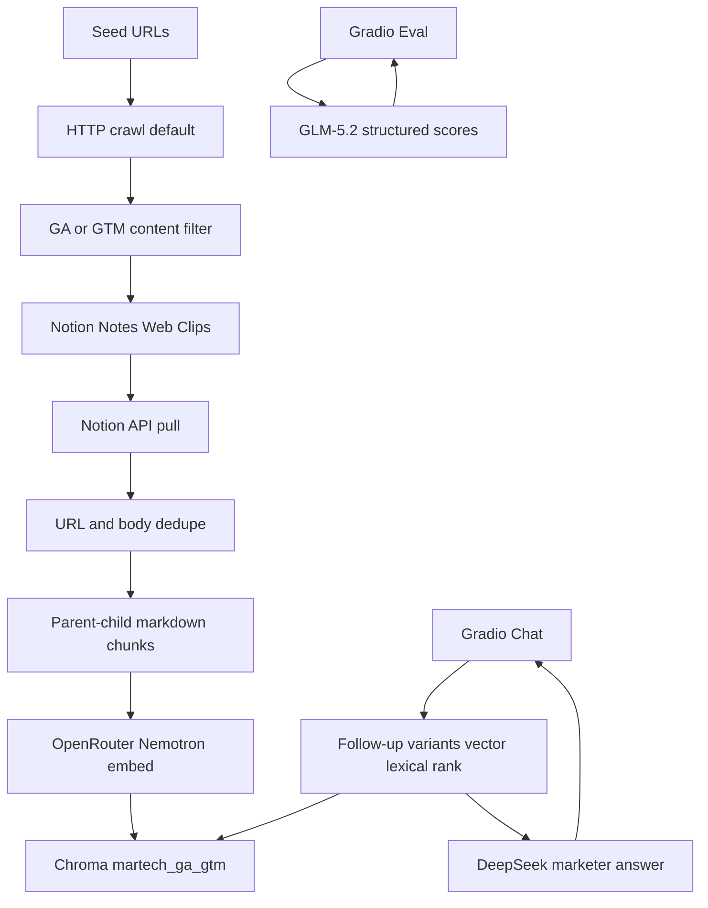

# Implementation Plan: Marketing Tracking RAG PoC

## Overview

Local Python RAG over official GA4/GTM docs. Crawl into Notion Web Clips, index with parent-child markdown chunks and Nemotron embeddings in Chroma, then chat and evaluate in one Gradio app.

**Status:** original build is done (`tasks/todo.md` all checked). This file is the **as-built** plan: what shipped, which decisions changed, and optional follow-ups.

Technique-by-technique write-up (with examples and snippets): [docs/rag-techniques.md](../docs/rag-techniques.md).

## Architecture (as built)

## Architecture decisions

- **Notion is the source of truth after crawl.** Indexing always reads Web Clips via the official Notion API (`NOTION_TOKEN`). Cursor Notion MCP is for agent setup only.
- **HTTP-only crawl by default.** Google docs fetch reliably over HTTP. Playwright/Crawl4AI is opt-in (`CRAWL_USE_BROWSER=true`) because the browser extra failed to install on this machine.
- **Parent-child chunking.** Google help pages share the same intro. Embedding 500-char
  children and returning the parent section (~2800 chars) keeps search specific and the
  LLM context complete. Boilerplate “set up the Google tag” intros are dropped.
- **Lexical + page-kind ranking instead of LLM rewrite/expand/rerank.** GLM rewrite/expand/rerank
  added latency and still retrieved Floodlight, API, and generic setup pages. Live retrieve
  now: combine follow-ups → GA4/GTM search variants → vector search → lexical overlap +
  page-kind boost → one chunk per URL.
- **Chat voice is marketer-facing.** Answers recommend one method, quote retrieved pages, and include a “copy this to your developer” brief. Vague questions ask 2–3 clarifying questions first.
- **One Gradio app, two tabs** (Chat + Eval) at `127.0.0.1:7860`. Windows launch opens Chrome, not Cursor’s Simple Browser.
- **Python 3.12 + uv.** Secrets only in `.env`. Notion IDs have defaults in `config.py`.

## What changed from the original Cursor plan

| Original plan | As built |
|---------------|----------|
| Crawl4AI / Playwright as the default fetcher | HTTP-only default; browser path optional |
| Simple header split then size fallback | Parent-child chunks + boilerplate filter + note dedupe |
| Live retrieval: rewrite → expand → vector → LLM rerank | Live retrieval: follow-up + variants + vector + lexical/page-kind rank |
| Chat as a MarTech expert citing chunks | Chat as a marketer guide with a developer brief |
| `.env.example` in the repo | Added when docs were brought up to date |
| Python 3.11+ | Python 3.12 (`.python-version` + `pyproject.toml`) |

Unused helpers `rewrite_query`, `expand_query`, and `rerank_chunks` remain in `retrieval.py`. They are not on the live path. Eval still uses GLM structured outputs.

## Completed phases

1. Scaffold, OpenRouter async client, Pydantic schemas, README Notion setup
2. Recursive crawl + GA/GTM filter + Notion upsert (resume via `data/crawl_state.json`)
3. Notion pull → chunk → embed → Chroma
4. Retrieval + chat chain
5. Gradio Chat with retrieved-chunk panel
6. Test-set generation + judge + Eval tab
7. Smoke e2e and later retrieval/prompt tuning

Last crawl snapshot: ~3199 visited, ~3178 stored, 6 failed. Last eval (10 generated questions): accuracy 0.975, completeness 0.985, relevance 0.97.

## Risks and mitigations

| Risk | Impact | Mitigation |
|------|--------|------------|
| Google help pages share the same intro | High | Parent-child chunks; drop boilerplate intros |
| Corpus includes API, BigQuery, ads, legacy UA | High | Page-kind downrank unless the question asks for that kind |
| LLM rewrite/rerank was slow and noisy | Med | Removed from live path; keep helpers for a later experiment |
| Notion markdown writes can exceed 60s | Med | `NOTION_TIMEOUT_MS=180000` and retries |
| Playwright install failed on Windows | Med | HTTP-only default |
| Eval questions are LLM-generated from sampled chunks | Med | Treat scores as a smoke signal, not a gold set |
| Vague “track events” questions | Med | Clarifying questions before a setup guide |

## Optional follow-ups

Not required for the PoC to run. Do these only if you want another iteration:

- Delete or wire up unused `rewrite_query` / `expand_query` / `rerank_chunks`
- Add a small pytest suite around chunking, URL normalize, and retrieval ranking
- Hand-write a gold eval set (purchase, click, Enhanced Measurement, SST) instead of generated questions
- Narrow crawl seeds if the ~3k-page corpus is more API/BigQuery than how-to

## Open questions

None blocking. The original locked assumptions (Notion store, Gradio Chat+Eval, OpenRouter models, `.env` secrets) still hold.
